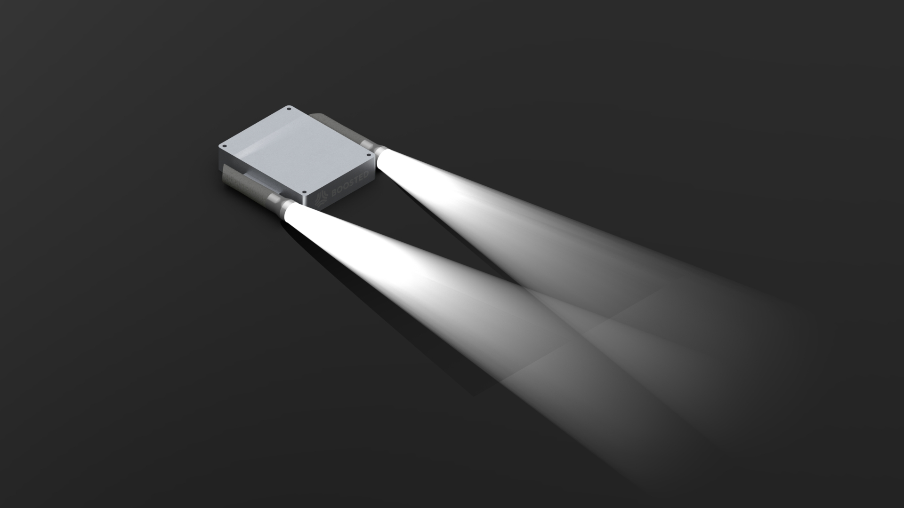

# Boosted "Beams"

With the current state of Boosted, the resale value for Boosted Beams is quite insane. The hope of this project is to provide a set of lights that offers a similar featureset and design style as the Beams while maintaining a reasonable price.

Roadmap:

- [X] Initial conceptualization
- [X] Initial mock-up
- [ ] Basic riser design (CAD)
- [ ] Basic light structure (CAD)
- [ ] Basic support structure (CAD)
- [X] Basic circuit topology
- [ ] Schematic creation
- [ ] PCB routing
- [ ] Part finalization
- [ ] Testing
- [ ] Finalization
- [ ] Production
- [ ] Update (Use acc. port, wireless communication, etc.)

## Design Requirements

In order to make something that fits well with the Boosted lineup of products, the lights need to have a certain set of features to make them worthwhile (vs. something like Shredlights). These are as follows:

- Easy turn on (remote, or some other concept)
- Automatic brake light
- 600 - 800 lm. total
- Long runtime (ideally, no charging)
- Soft startup/shutdown (fade in/out)
- Compact, hard mounted design
- Little to no user intervention required

## Circuit Topology

The project aims to use only analog circuitry to allow for easy repair of the system (no code to flash to any microcontrollers). To meet the criterion stated above, the following topology has been established

### Easy turn on & brake light

To allow for easy turn on and brake light use, an analog accelerometer will be used. The output of the accelerometer is to be filtered and buffered with a voltage follower to provide accurate outputs. RC circuitry combined with 555 timers will be utilized to create a delay before certain actions are completed (notably, turn on will need sustained motion prior to toggling lights). The brake light will use a comparator circuit to check for proper acceleration events with capacitive smoothing to ensure proper turn on/off events are established. An ambient light sensor will also be utilized to ensure that the board really needs the lights on prior to turn on.

### Long runtime

Given a battery life of 1000 mAh, the lights should be able to sustain at least 2 and a half hours of runtime.

### Soft start/shutdown

Simple RC circuitry will easily be able to replicate this effect. The source of the power mosfet driving the LED will connect directly to an RC circuit that allows precide fade in/out of each set of lights.

### Limited user intervention

Due to the nature of the accessory port, it cannot be relied on to power lights for a majority of boards. Therefore, the boards will need to be powered via an onboard battery. Given the nature of hardmounting lights to a board, the current design strategy is to have the main circuitry of the lights removable from the board via magnets to allow for easy charging.
